# E志愿志愿者服务平台 V1.0 软件使用说明书

| 项目 | 内容 |
| --- | --- |
| 软件全称 | E志愿志愿者服务平台 |
| 软件简称 | E志愿 |
| 版本号 | V1.0 |
| 文档类型 | 软件使用说明书 |
| 编写日期 | 2026 年 9 月 |

---

## 目录

1. [软件概述](#1-软件概述)
2. [运行环境](#2-运行环境)
3. [软件安装与启动](#3-软件安装与启动)
4. [功能与操作说明](#4-功能与操作说明)
   - 4.1 [公众门户](#41-公众门户)
   - 4.2 [志愿者注册](#42-志愿者注册)
   - 4.3 [用户登录与注销](#43-用户登录与注销)
   - 4.4 [平台管理员工作台](#44-平台管理员工作台)
   - 4.5 [志愿活动审核](#45-志愿活动审核)
   - 4.6 [志愿者组织工作台](#46-志愿者组织工作台)
   - 4.7 [申报志愿活动](#47-申报志愿活动)
   - 4.8 [志愿活动分类管理](#48-志愿活动分类管理)
   - 4.9 [活动报名人员与报名审核](#49-活动报名人员与报名审核)
   - 4.10 [组织资料维护](#410-组织资料维护)
   - 4.11 [活动状态页面示例](#411-活动状态页面示例)
   - 4.12 [志愿者工作台](#412-志愿者工作台)
   - 4.13 [活动广场与供需匹配](#413-活动广场与供需匹配)
   - 4.14 [我的报名与可信签到](#414-我的报名与可信签到)
   - 4.15 [我的档案](#415-我的档案)
   - 4.16 [志愿服务证明与在线校验](#416-志愿服务证明与在线校验)
   - 4.17 [签到与时长复核](#417-签到与时长复核)
   - 4.18 [申报活动技能与签到设置](#418-申报活动技能与签到设置)
   - 4.19 [审核驳回原因与重新申报](#419-审核驳回原因与重新申报)
   - 4.20 [活动状态流转与结算](#420-活动状态流转与结算)
   - 4.21 [服务时长补录与数据导出](#421-服务时长补录与数据导出)
   - 4.22 [培训管理](#422-培训管理)
   - 4.23 [活动公告管理](#423-活动公告管理)
   - 4.24 [消息通知](#424-消息通知)
   - 4.25 [培训与活动公告（志愿者）](#425-培训与活动公告志愿者)
   - 4.26 [志愿秀](#426-志愿秀)
   - 4.27 [志愿秀广场](#427-志愿秀广场)
   - 4.28 [补录时长复核](#428-补录时长复核)
   - 4.29 [账号管理](#429-账号管理)
   - 4.30 [通知公告与附件](#430-通知公告与附件)
   - 4.31 [审计日志](#431-审计日志)
   - 4.32 [服务对象确认](#432-服务对象确认)
   - 4.33 [异常时长裁定](#433-异常时长裁定)
5. [权限与安全说明](#5-权限与安全说明)
6. [业务状态说明](#6-业务状态说明)
7. [常见问题](#7-常见问题)

---

## 1 软件概述

E志愿志愿者服务平台是一个面向志愿者、志愿者组织与平台管理员的志愿活动管理软件。平台围绕志愿服务业务，
把志愿活动的申报、审核、发布、报名与报名审核等环节串联起来，形成完整的线上工作流程：

1. 公众可以浏览平台首页，了解志愿活动与志愿者组织，并注册成为志愿者；
2. 志愿者组织登录后可以申报志愿活动，申报的活动提交平台审核；
3. 平台管理员登录后对志愿者组织申报的活动进行审核，审核通过的活动进入志愿服务活动阶段；
4. 志愿者组织可以按状态管理本组织申报的全部志愿活动，查看活动报名人员并审核志愿者的报名申请；
5. 志愿者在个人工作台中维护技能标签与常住定位，平台按技能、距离、时间与历史参与推荐可报名活动，
   报名满员时自动进入候补队列，撤回或被驳回释放名额后自动递补；
6. 志愿者在现场使用志愿者组织公布的签到码并携带定位完成签到签退，服务时长由平台自动核算，
   经志愿者组织复核确认后计入个人累计服务时长并参与星级评定；
7. 志愿者可生成含校验码的志愿服务证明，第三方可在门户校验页输入志愿者编号与校验码验证证明真伪。

软件主要特点：

- **角色分离**：志愿者、志愿者组织与平台管理员使用同一登录入口，登录后按角色进入各自的工作台，页面与接口按角色隔离；
- **流程闭环**：活动申报、活动审核、重新申报、报名与候补、签到签退、时长复核与活动结算等关键业务均通过数据库存储过程写库，保证数据一致性；
- **可信时长**：服务时长经签到码、签到时间窗口、地理围栏与志愿者组织复核共同约束，异常轨迹自动标记；
- **智能匹配**：按技能命中比例、球面距离、时间冲突与组织历史参与四个维度计算匹配度，并给出可读的匹配理由；
- **数据留痕**：活动审核结果会记录审核管理员、审核时间、审核意见与结构化原因，报名审核、时长复核会记录审核时间与审核结果；
- **逻辑删除**：志愿活动、志愿者组织等业务数据采用逻辑删除，避免误删造成数据丢失。

## 2 运行环境

### 2.1 硬件环境

| 项目 | 要求 |
| --- | --- |
| 处理器 | 双核 2.0GHz 及以上 |
| 内存 | 4GB 及以上 |
| 硬盘 | 20GB 及以上可用空间 |
| 显示 | 分辨率 1280×720 及以上 |

### 2.2 软件环境

| 项目 | 要求 |
| --- | --- |
| 操作系统 | Windows 10/11、Linux、macOS |
| 运行环境 | JDK 11 及以上 |
| 数据库 | MySQL 8.0 及以上 |
| 浏览器 | Chrome、Edge、Firefox 等主流浏览器 |
| 其他 | 无需额外安装 Web 服务器，程序内置 Tomcat 容器 |

## 3 软件安装与启动

### 3.1 初始化数据库

使用 MySQL 客户端执行项目中的数据库脚本 `src/main/resources/db/e_volunteer_platform.sql`：

```bash
mysql -uroot -p < src/main/resources/db/e_volunteer_platform.sql
```

脚本会自动完成以下工作：

1. 创建数据库 `e_volunteer_platform`；
2. 创建 14 张业务数据表；
3. 创建 4 个业务存储过程：志愿者注册 `volunteer_insert`、志愿活动申报 `organization_insert_activity`、
   志愿活动审核 `admin_check_activity`、报名审核 `organization_check_volunteer`；
4. 写入初始化数据，包括 1 个平台管理员账号、2 个志愿者组织账号、4 名志愿者以及 6 条志愿活动数据。

### 3.2 配置数据库连接

数据库连接信息保存在 `src/main/resources/application.properties` 中，默认连接本机 `3306` 端口的
`e_volunteer_platform` 数据库。如与实际环境不一致，可直接修改该文件，也可以使用环境变量覆盖：

```bash
export EVOLUNTEER_DB_URL="jdbc:mysql://localhost:3306/e_volunteer_platform?useUnicode=true&characterEncoding=utf-8&serverTimezone=Asia/Shanghai"
export EVOLUNTEER_DB_USERNAME=root
export EVOLUNTEER_DB_PASSWORD=数据库密码
```

### 3.3 启动软件

在项目根目录执行：

```bash
mvn clean package -DskipTests
java -jar target/e-volunteer-platform-1.0.0.jar
```

程序启动成功后，控制台输出 `Started EVolunteerApplication in x.xxx seconds`，服务默认监听 `8111` 端口。

### 3.4 访问地址

| 页面 | 访问地址 |
| --- | --- |
| 公众门户 | `http://localhost:8111/portal/index.html` |
| 用户登录 | `http://localhost:8111/admin/login.html` |
| 志愿者注册 | `http://localhost:8111/admin/sign-up.html` |
| 志愿者工作台 | `http://localhost:8111/volunteer/index.html` |
| 活动广场 | `http://localhost:8111/volunteer/activity_plaza.html` |
| 我的报名与签到 | `http://localhost:8111/volunteer/my_participation.html` |
| 我的档案 | `http://localhost:8111/volunteer/profile.html` |
| 志愿服务证明 | `http://localhost:8111/volunteer/certificate.html` |
| 签到与时长复核（志愿者组织） | `http://localhost:8111/org/checkin_review.html` |
| 服务证明校验（公众） | `http://localhost:8111/portal/verify.html` |

### 3.5 初始化账号

| 角色 | 登录账号 | 初始密码 | 登录后进入 |
| --- | --- | --- | --- |
| 平台管理员 | `admin_001` | `123456` | 平台管理员工作台 |
| 志愿者组织 | `org_001` | `123456` | 志愿者组织工作台 |
| 志愿者组织 | `org_002` | `123456` | 志愿者组织工作台 |
| 志愿者 | `vol_00001`～`vol_00004` | `123456` | 志愿者工作台 |
| 志愿者 | 注册时生成的志愿者编号 | 注册时设置的密码 | 志愿者工作台 |

## 4 功能与操作说明

### 4.1 公众门户

公众门户为无需登录即可访问的首页，地址为 `http://localhost:8111/portal/index.html`。
页面由三部分组成：顶部导航与「注册/登录」入口、志愿者组织展示区、志愿活动风采展示区；
页面底部提供「用户登录」「志愿者注册」快捷入口。点击志愿活动卡片可跳转到登录页面。


### 4.2 志愿者注册

**入口**：公众门户顶部「注册/登录」→ 登录页「注册账号」，或直接访问 `http://localhost:8111/admin/sign-up.html`。

**操作步骤**：

1. 在「志愿者注册」页面填写姓名、手机号与登录密码；
2. 手机号输入框失去焦点时，系统自动调用手机号查重接口，未注册的手机号在输入框后显示「√」，
   已注册的手机号提示「该手机号已被注册」；
3. 点击注册按钮提交。注册成功后页面提示新生成的志愿者编号（形如 `vol_00005`），
   注册日期由系统自动写入，密码以摘要方式保存。

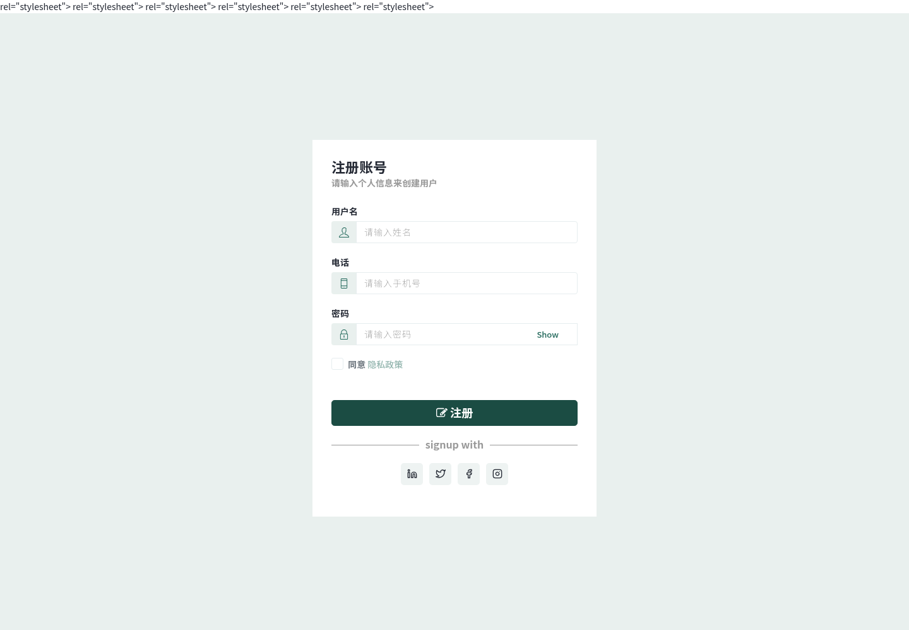

### 4.3 用户登录与注销

**登录入口**：`http://localhost:8111/admin/login.html`。

**操作步骤**：

1. 输入登录账号与密码，点击「登录」；
2. 认证通过后，平台管理员自动进入平台管理员工作台（`/admin/index.html`），
   志愿者组织自动进入志愿者组织工作台（`/org/index.html`）；
3. 账号或密码错误时，登录页会提示认证失败信息。

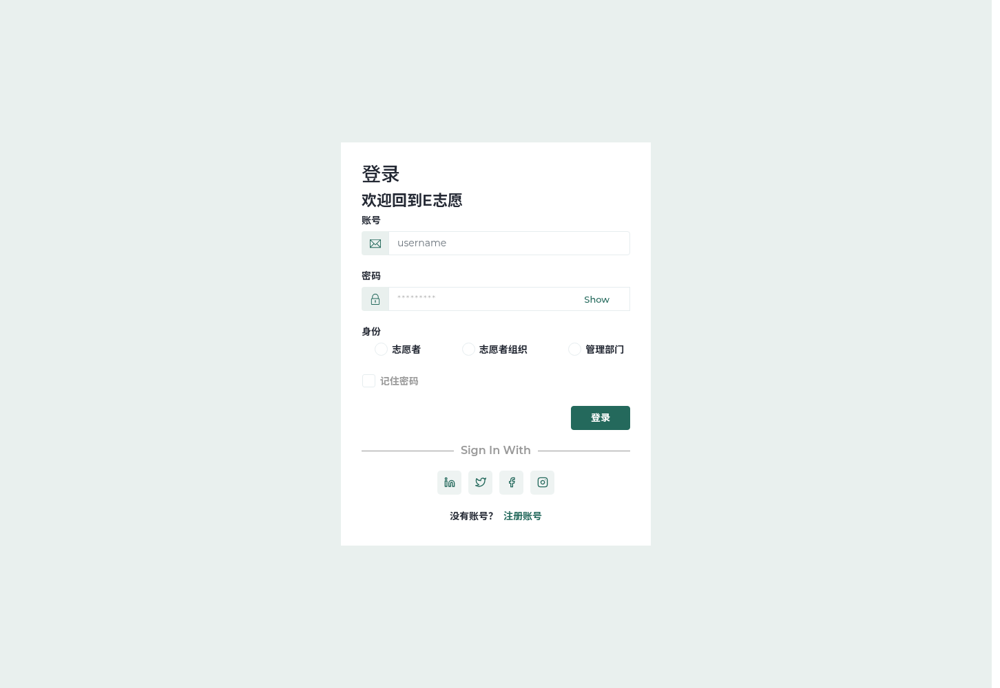

**注销**：点击控制台页面右上角「退出登录」，系统清除登录会话并返回登录页面，
再次访问控制台页面会要求重新登录。

### 4.4 平台管理员工作台

**入口**：平台管理员登录后自动进入，或点击左侧菜单「工作台 → 管理员工作台」。

工作台包含三部分内容：

- **待审核志愿活动**：统计当前等待平台审核的志愿活动数量；
- **待审核活动数量**：统计工作台列表中展示的待审核活动数量；
- **待审核的志愿活动列表**：展示活动名称、活动地点、活动起止时间、报名截止时间与招募人数，
  每行提供「审核」按钮跳转到志愿活动审核页面。

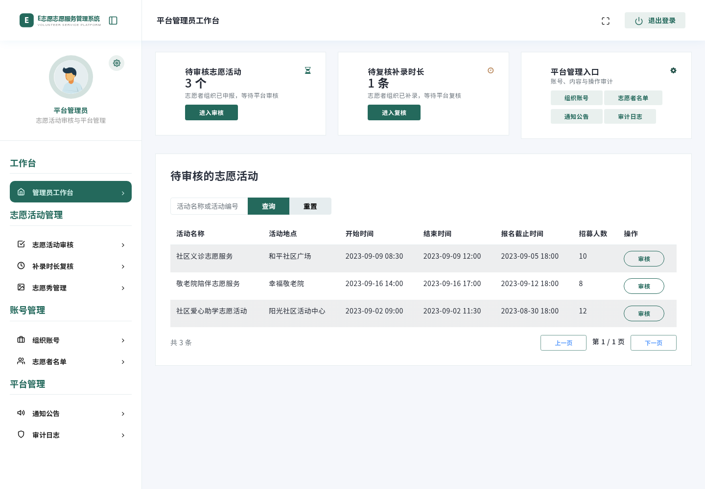

### 4.5 志愿活动审核

**入口**：平台管理员工作台左侧菜单「志愿活动管理 → 志愿活动审核」。

**操作步骤**：

1. 页面自动加载平台内全部处于「审核中」状态的志愿活动；
2. 点击活动所在行的「查看详情」，可在弹窗中查看活动的名称、内容、起止时间、地点、需求人数、
   注意事项与报名截止时间；
3. 点击「通过」，系统将该活动状态置为「未开始」，同时记录审核管理员、审核时间与审核意见；
4. 点击「不通过」，系统将该活动状态置为「审核未通过」，并记录相应的审核信息；
5. 审核完成后点击「关闭」返回列表。

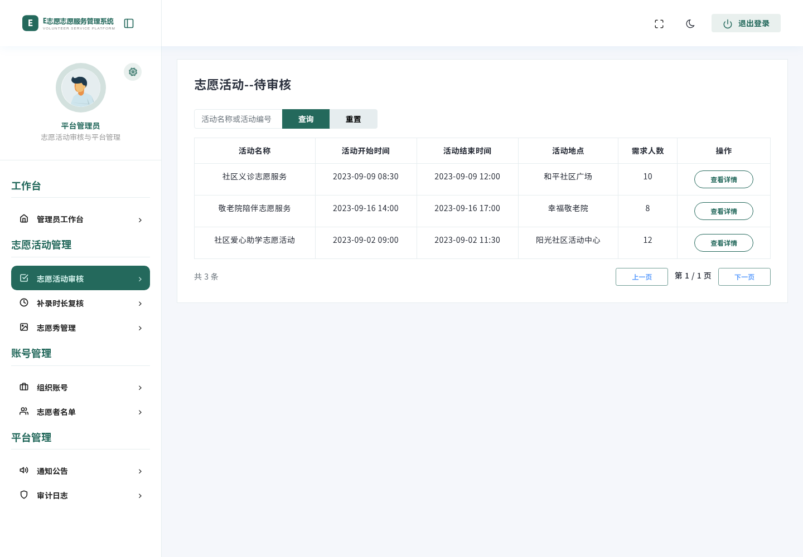

### 4.6 志愿者组织工作台

**入口**：志愿者组织登录后自动进入，或点击左侧菜单「工作台 → 组织工作台」。

工作台包含三部分内容：

- **活动状态统计**：分别统计本组织「审核中的活动」「未开始的活动」「进行中的活动」「已结束的活动」数量；
- **审核中的志愿活动列表**：展示本组织已申报、等待平台审核的活动及其时间、地点与招募人数；
- **组织资料卡片**：展示当前登录组织的组织编号、组织名称、成立日期与组织简介。

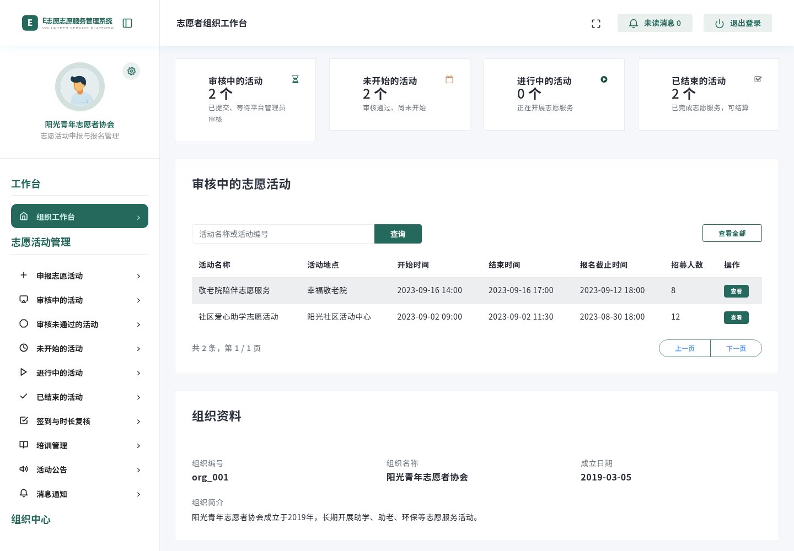

### 4.7 申报志愿活动

**入口**：左侧菜单「志愿活动管理 → 申报志愿活动」。

**操作步骤**：

1. 填写活动名称、活动内容、活动开始时间、活动结束时间、活动地点、需求人数、注意事项与报名截止时间；
2. 活动名称输入完成后，系统自动调用活动名称查重接口，名称已被占用时页面给出提示；
3. 点击「提交」提交申报。系统对活动时间与招募人数进行格式校验：
   时间格式不正确时提示「活动时间格式不正确，请重新选择活动时间」，
   招募人数不是数字时提示「招募人数必须为数字，请重新填写」；
4. 校验通过后，活动写入数据库并生成活动编号，状态为「审核中」，等待平台管理员审核，
   页面提示「志愿活动申报成功，等待平台管理员审核」。

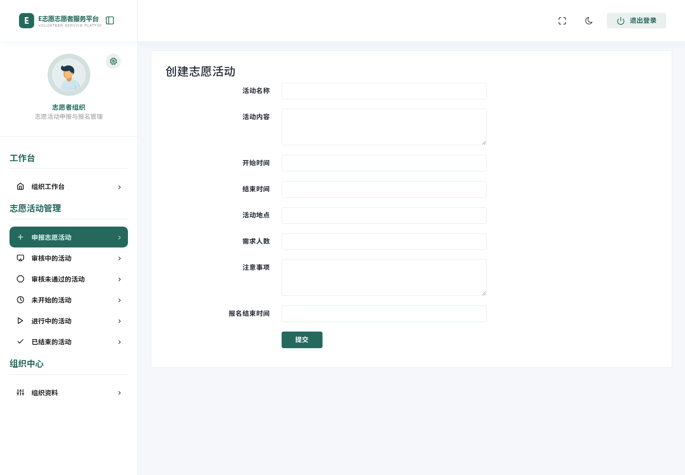

### 4.8 志愿活动分类管理

**入口**：左侧菜单「志愿活动管理」下的各个菜单项。

| 菜单 | 展示内容 | 支持操作 |
| --- | --- | --- |
| 审核中的活动 | 本组织已申报、等待平台审核的活动 | 查看活动详情、删除活动 |
| 审核未通过的活动 | 经平台管理员审核未通过的活动 | 查看活动详情、删除活动 |
| 未开始的活动 | 审核通过、尚未开始的活动 | 查看活动详情、查看报名人员 |
| 进行中的活动 | 正在开展的活动 | 查看活动列表 |
| 已结束的活动 | 已完成并归档的活动 | 查看活动列表 |

删除活动采用逻辑删除方式，删除后活动不再出现在列表中，数据库中仍保留原始记录。

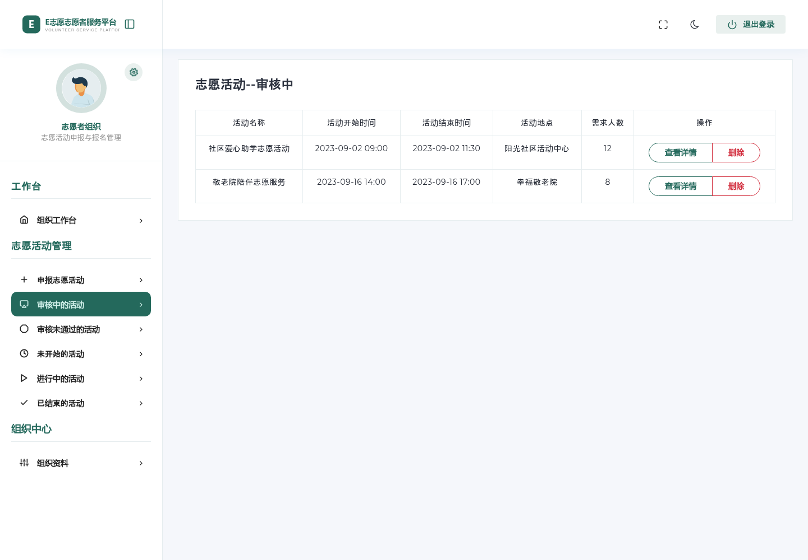

### 4.9 活动报名人员与报名审核

**入口**：左侧菜单「志愿活动管理 → 未开始的活动」，点击活动所在行的「志愿者招募」。

**操作步骤**：

1. 弹窗中列出该活动的报名志愿者，展示志愿者编号、姓名、性别、出生日期与联系电话；
2. 点击报名记录后面的「√」，系统通过该报名申请，报名状态更新为「已通过」；
3. 点击报名记录后面的「×」，系统驳回该报名申请，报名状态更新为「未通过」；
4. 审核结果与审核时间由数据库存储过程一并写入报名记录。

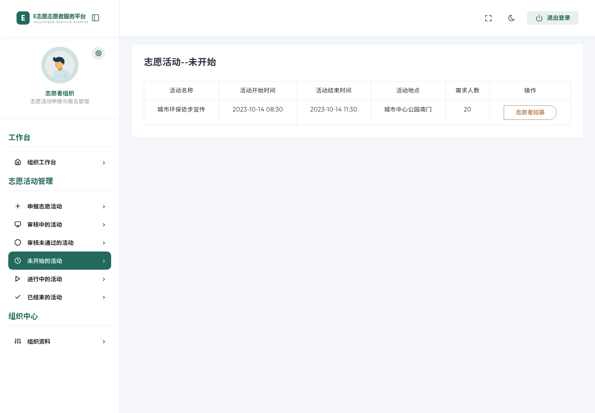

### 4.10 组织资料维护

**入口**：左侧菜单「组织中心 → 组织资料」。

**操作步骤**：

1. 页面自动加载当前登录组织的组织编号、组织名称与组织简介；
2. 修改组织名称或组织简介后点击「修改」，系统保存修改内容并提示「修改成功」。

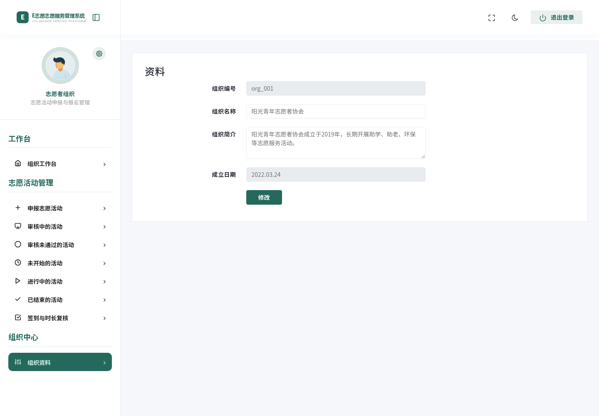

### 4.11 活动状态页面示例

「审核未通过的活动」「进行中的活动」「已结束的活动」三个菜单与「审核中的活动」页面结构一致，
分别展示对应状态的志愿活动，页面同样支持查看活动详情与逻辑删除操作。

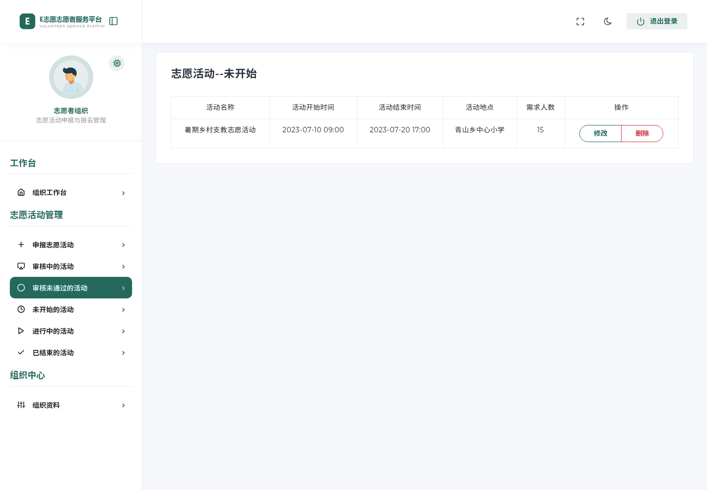

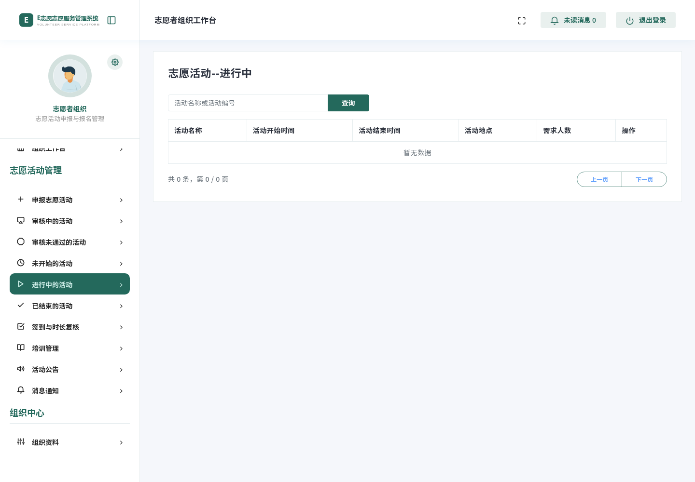


### 4.12 志愿者工作台

志愿者使用注册时获得的志愿者编号登录，登录后进入志愿者工作台。工作台展示已核定累计服务时长、
参与活动数、志愿服务信用分与当前星级，并给出距离下一星级还需的服务时长；下方为按匹配度排序的推荐活动
与最近报名记录。

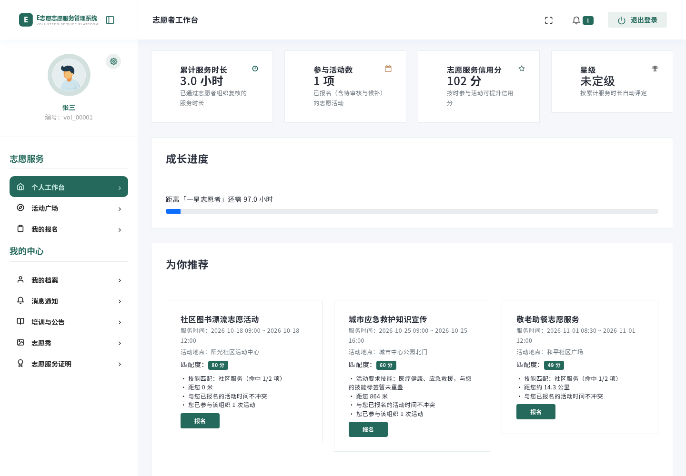

### 4.13 活动广场与供需匹配

「活动广场」列出当前可报名的志愿活动，平台按技能命中比例、志愿者常住地点与活动地点的距离、
活动时间与已报名活动是否冲突、在该组织的历史参与次数四个维度计算匹配度，并逐条给出匹配理由
（例如「技能匹配：社区服务（命中 1/2 项）」「距您 864 米」「与您已报名的活动时间不冲突」）。
点击「报名」提交报名申请；名额已满时页面提示已进入候补队列。

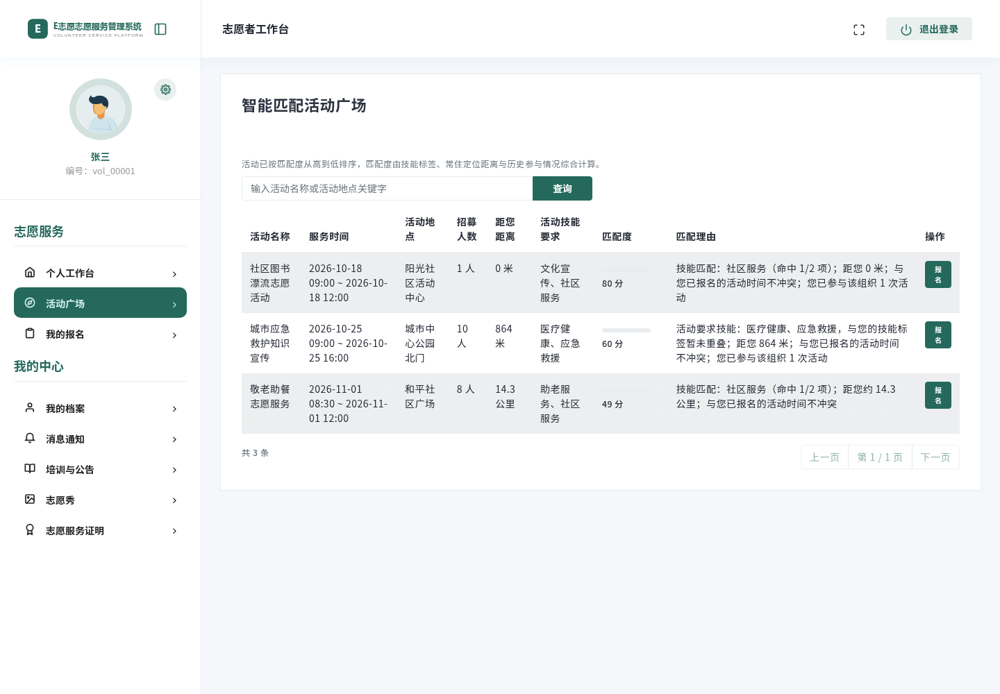

### 4.14 我的报名与可信签到

「我的报名」展示本人全部报名记录及其状态（待审核、已通过、候补、未通过）、服务时长与时长复核结果。
报名通过后可执行以下操作：

1. **签到**：活动当天点击「签到」，输入志愿者组织在活动现场公布的签到码，并允许浏览器获取当前位置；
   签到码每 120 秒自动轮换，过期签到码不再有效；平台校验签到码、签到时间窗口（活动开始前 60 分钟至活动结束）
   与地理围栏，超出围栏或缺少定位的记录会被标记为异常并提交志愿者组织复核；
2. **签退**：活动结束后点击「签退」，平台按签到签退时间自动核算服务时长，异常时长同样提交复核；
3. **撤回报名**：未签到的报名可撤回，已通过的报名撤回后会释放名额并自动递补候补志愿者。

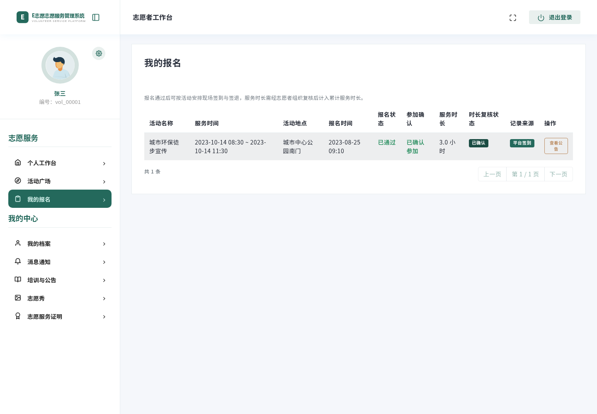

### 4.15 我的档案

志愿者在「我的档案」中维护服务技能标签（助学支教、助老服务、环保公益、社区服务、医疗健康、
应急救援、大型赛会、文化宣传、心理疏导、信息技术共 10 项）与常住定位，作为活动匹配与距离计算的依据；
页面同时展示志愿服务信用分、爽约次数与累计服务时长。

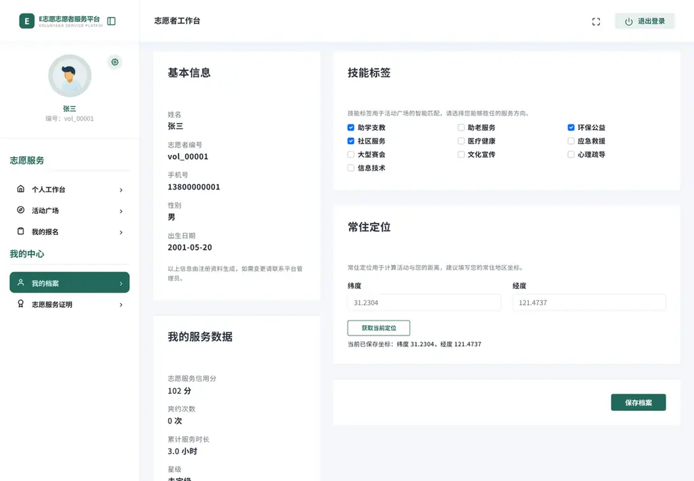

### 4.16 志愿服务证明与在线校验

「志愿服务证明」汇总志愿者已核定累计服务时长、已核定服务记录明细与星级，并给出 16 位校验码，
支持直接打印。校验码由平台密钥对志愿者的累计服务数据计算得出，数据变动后校验码随之变化。

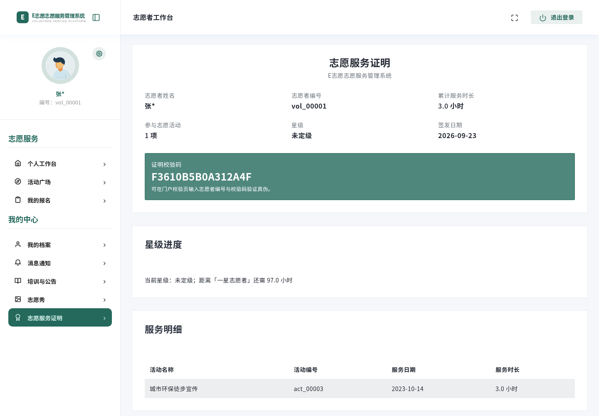

第三方可在门户「服务证明校验」页输入志愿者编号与校验码核验证明真伪，校验通过时展示脱敏后的姓名、
累计服务时长、参与活动数、星级与签发日期；校验码不符时提示该证明可能被篡改或不存在。


### 4.17 签到与时长复核

志愿者组织在「签到与时长复核」页选择活动后，可以查看该活动**当前生效的签到码**（每 120 秒自动轮换，
页面同步倒计时并自动刷新；点击「更换密钥并重新生成」可立即作废旧签到码），并查看该活动的全部服务记录
（志愿者编号、姓名、联系电话、签到签退时间、服务时长、签到距离、轨迹标记、复核状态与来源）。
页面还展示每条记录的**服务对象确认状态**与**异常标记**。

对「待复核」的平台签到记录可执行「确认时长」或「驳回」：确认后服务时长计入志愿者累计服务时长并奖励信用分，
驳回则本次时长不计入累计；若记录命中时长异常规则，则改由平台管理员裁定。
对已有签退时间的记录可点击「生成服务确认单」填写服务对象名称与手机号，平台生成确认码交由服务对象核对。

活动结束后可点击「活动结算」结算考勤，对已通过报名但未签退的志愿者记录爽约并扣减信用分
（同一活动只能结算一次）。

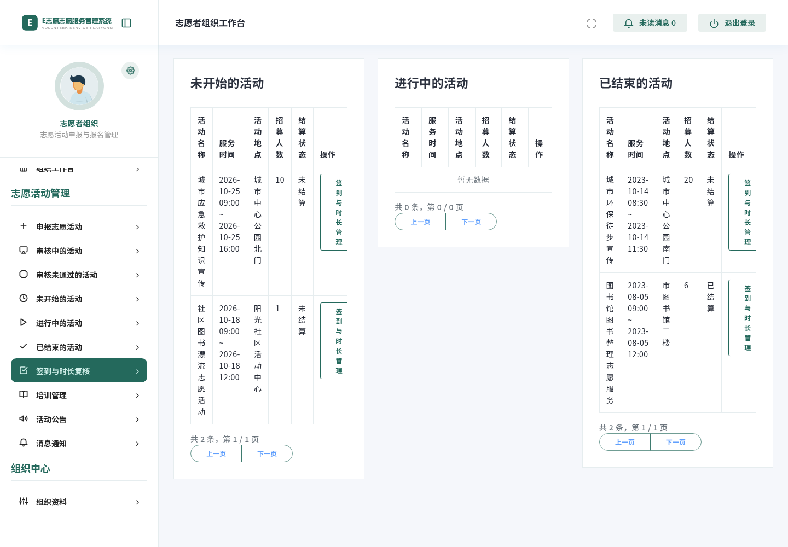

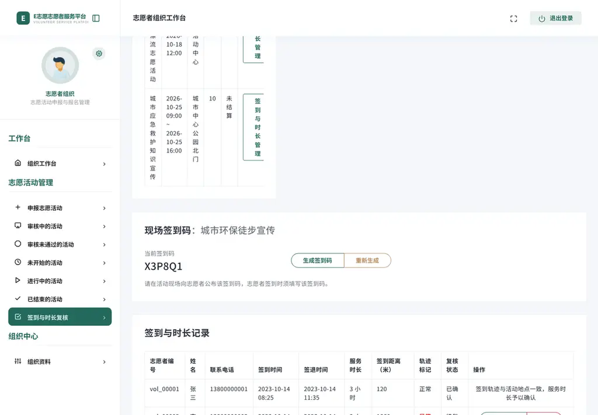

### 4.18 申报活动技能与签到设置

志愿者组织申报志愿活动时，除活动名称、内容、时间、地点、需求人数、注意事项与报名截止时间外，
还需选择活动所需的服务技能标签（用于供需匹配），并填写活动地点定位与签到围栏半径（默认 300 米，
用于签到位置校验）。活动开始与结束时间需精确到分钟。

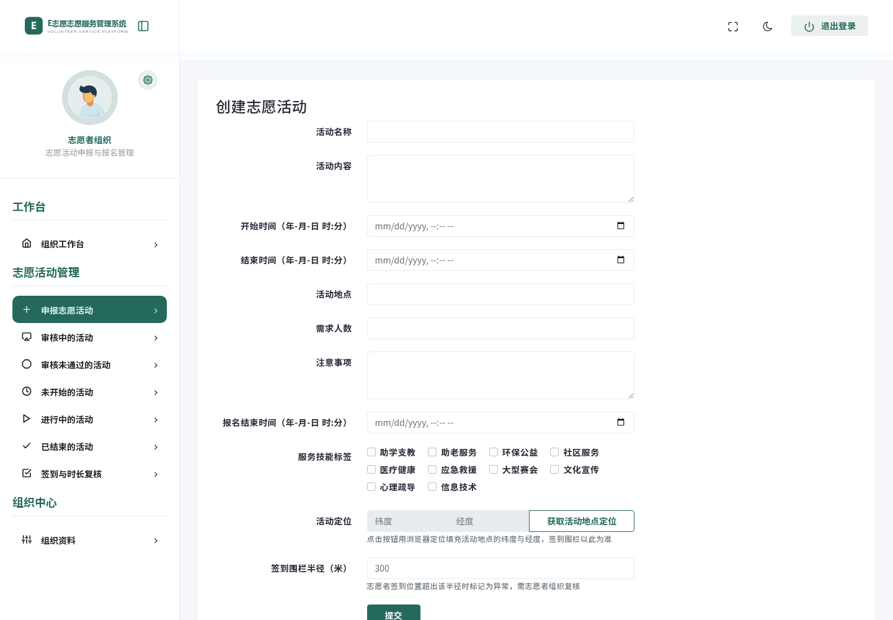

### 4.19 审核驳回原因与重新申报

平台管理员审核志愿活动时，审核通过可直接提交；审核不通过必须选择结构化原因（活动方案不完整、
人员安排不明确、活动时间或场地存在冲突、活动信息缺失、存在安全风险、其他原因）并可填写审核意见，
未选择原因时平台拒绝提交。

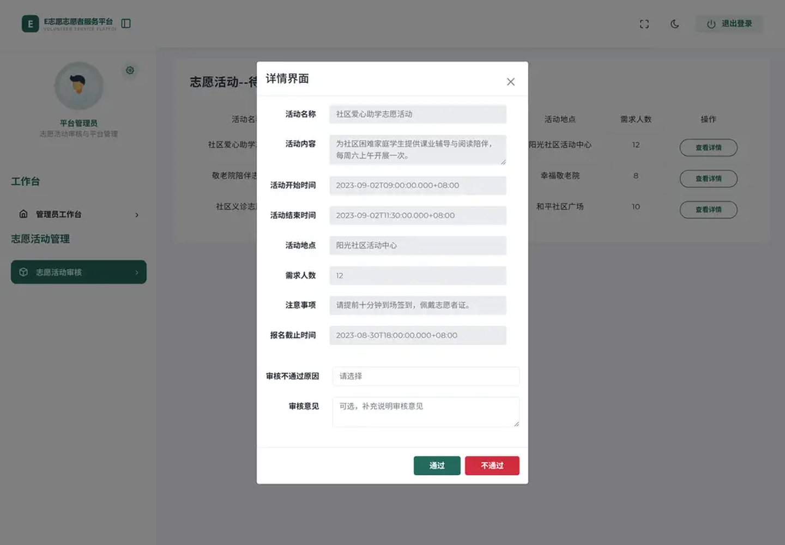

志愿者组织在「审核未通过的活动」页可查看审核时间与驳回原因，并在弹窗中修改活动信息
（含技能标签、活动定位与签到围栏半径）后点击「修改后重新申报」，活动重新进入「审核中」状态，
平台记录该活动的修改次数。

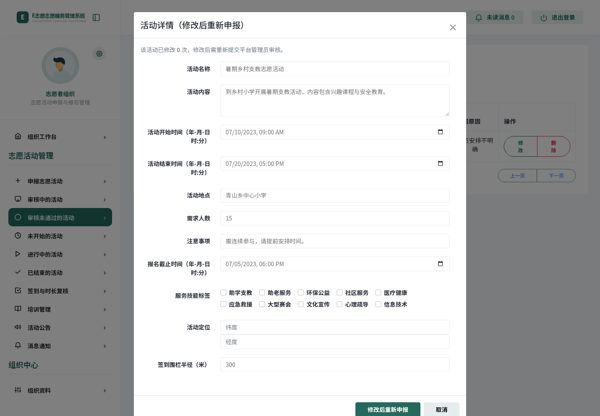

### 4.20 活动状态流转与结算

志愿活动状态既可以由志愿者组织人工流转，也会由平台定时任务按活动时间自动流转。

1. **人工流转**：在「未开始的活动」列表点击「开始活动」把活动置为进行中；在「进行中的活动」或
   「未开始的活动」列表点击「结束活动」把活动置为已结束；
2. **自动流转**：到达活动开始时间后，定时任务自动把未开始的活动置为进行中；超过活动结束时间后自动置为已结束；
3. **活动结算**：活动结束后，志愿者组织在「已结束的活动」或「签到与时长复核」页点击「活动结算」，
   平台对该活动已通过报名但未签退的志愿者记录爽约并扣减信用分；未结束的活动不能结算，同一活动只能结算一次。

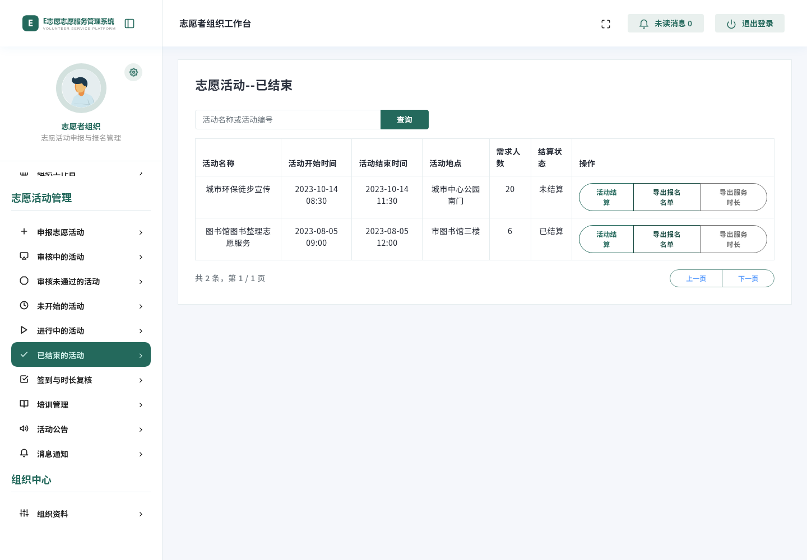

### 4.21 服务时长补录与数据导出

志愿者组织可在「签到与时长复核」页点击「补录服务时长」，选择本组织活动名单中已通过报名的志愿者，
填写服务起止时间与补录说明后提交：

1. 只能补录已经结束的服务时段，单条时长需大于 0 且不超过 24 小时；
2. 补录时段与该志愿者已有的服务记录重叠时会被拒绝；
3. 补录记录由**平台管理员复核**（与平台签到记录由志愿者组织复核相区分），复核通过后才计入志愿者累计服务时长。

页面同时提供「导出报名考勤」与「导出服务时长」两个导出入口，点击后可下载带表头的 CSV 文件，
可直接用表格软件打开汇总。

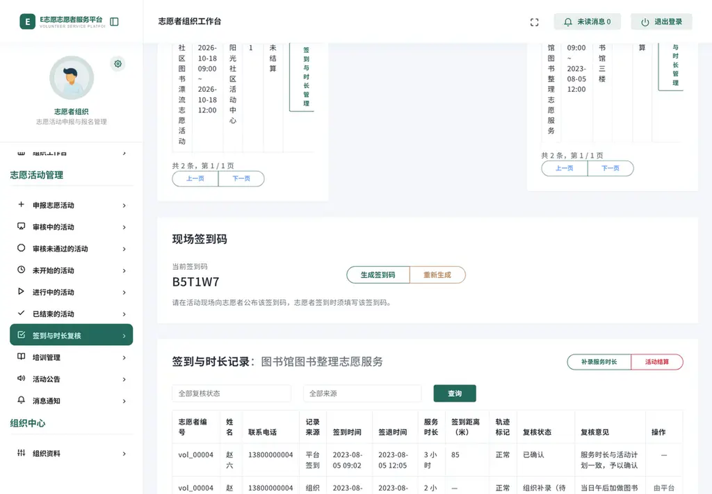

### 4.22 培训管理

志愿者组织在「培训管理」页选择活动后，可以新增、修改与删除该活动的培训安排
（培训名称、内容、起止时间、地点、签到方式），并可为培训登记志愿者的培训情况
（选择志愿者并填写培训起止时间）。培训时间必须晚于开始时间，且只能管理本组织申报的活动。

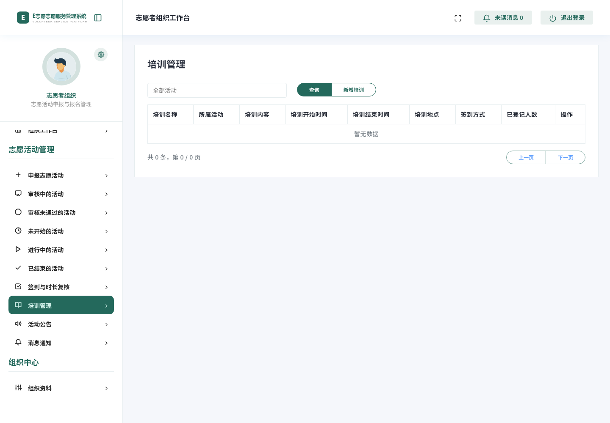

### 4.23 活动公告管理

志愿者组织在「活动公告」页选择活动后，可以发布、修改与删除活动公告。公告发布成功后，
平台会向该活动已通过报名的志愿者推送站内通知。

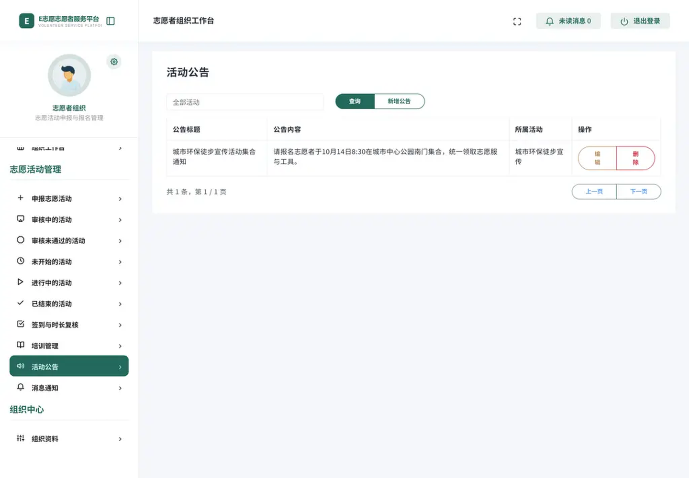

### 4.24 消息通知

志愿者与志愿者组织的工作台顶部展示未读消息数量，点击「消息通知」进入消息列表：未读通知以高亮行展示，
可单条「标记已读」，也可一键「全部已读」。通知覆盖报名提交与审核结果、参加确认、服务时长复核结果、
活动公告、活动开始与结束等节点。

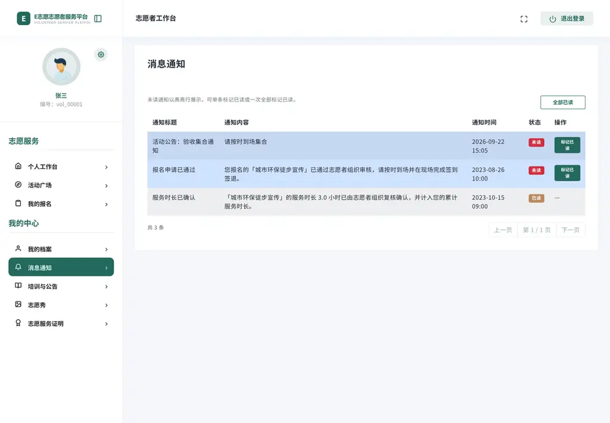

### 4.25 培训与活动公告（志愿者）

志愿者在「培训与公告」页可以查看本人已通过报名活动对应的培训安排与活动公告，
两个区块分别展示并可翻页。

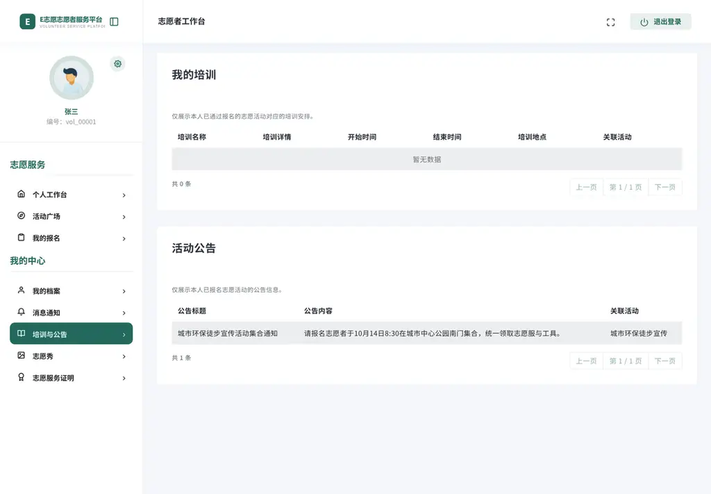

### 4.26 志愿秀

志愿者在「志愿秀」页填写分享内容、可选关联本人已通过报名的活动、上传现场图片后发布。
发布成功后可在下方查看本人发布的志愿秀，展示分享时间、图片数量、浏览数与点赞数，
并提供前往门户「志愿秀广场」的入口。

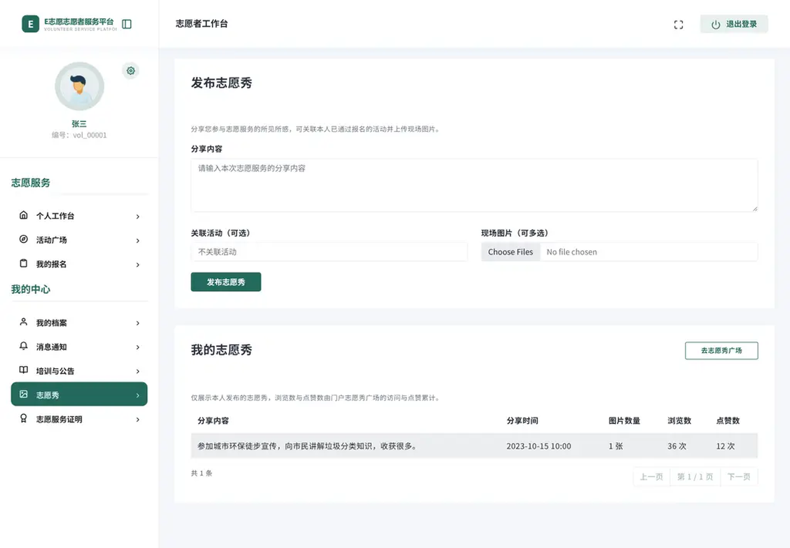

### 4.27 志愿秀广场

公众门户的「志愿秀广场」无需登录即可浏览志愿者分享的志愿服务经历：支持关键字检索与分页，
点击「查看详情」可在弹窗中查看完整内容与全部图片，详情访问会累加浏览次数。
登录的志愿者可以点赞，同一志愿者对同一志愿秀只计一次，重复点击即为取消点赞。

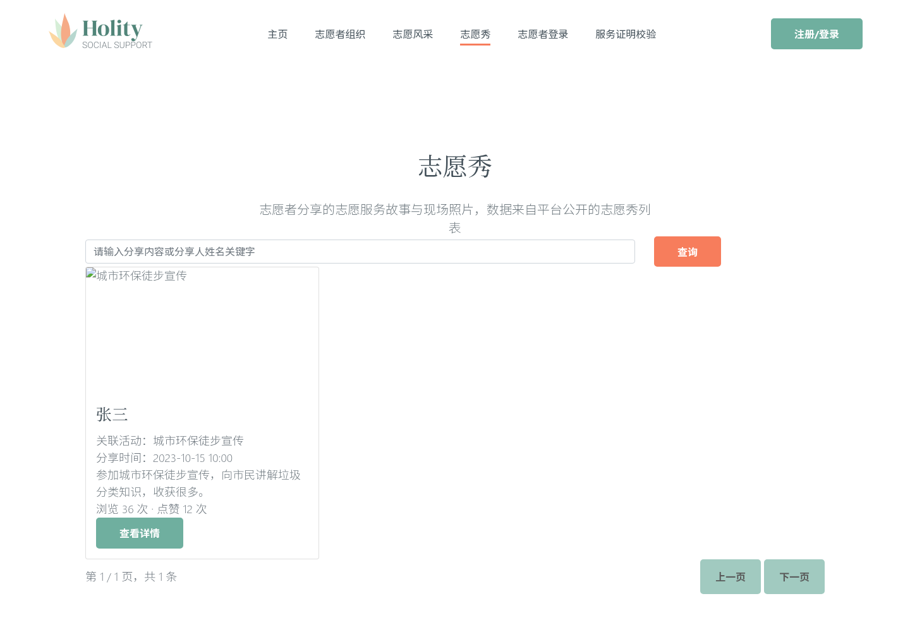

### 4.28 补录时长复核

平台管理员在「补录时长复核」页按复核状态与关键字查询志愿者组织补录的服务时长记录，
对「待复核」的记录可「确认时长」或「驳回」并填写复核意见：确认后服务时长计入志愿者累计服务时长并奖励信用分，
驳回则本次时长不计入累计；同一条补录记录不能重复复核。

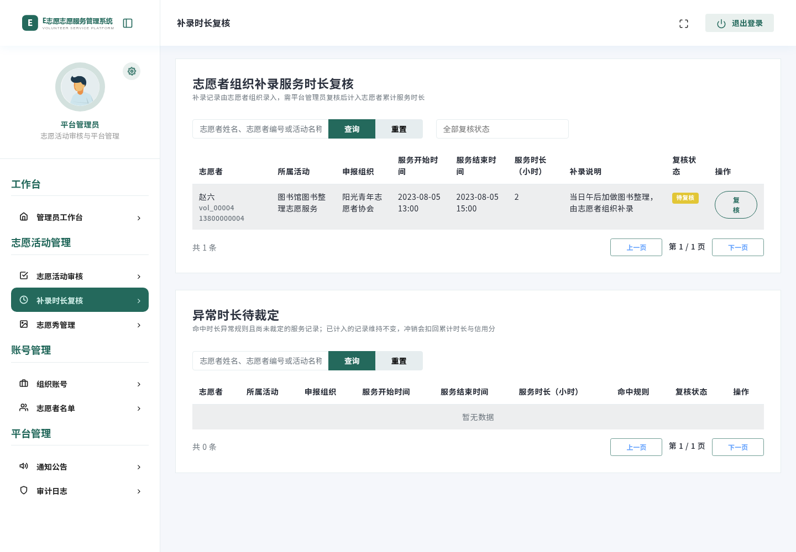

### 4.29 账号管理

平台管理员在「组织账号」页可以开通志愿者组织账号（不填写密码时由平台生成初始密码并在弹窗中显示一次）、
启用或停用组织账号、重置组织密码；在「志愿者名单」页可以按编号、姓名或手机号检索志愿者，
查看信用分、累计服务时长与爽约次数，启用或停用账号、重置密码，并可导出志愿者名册 CSV。
账号停用后该账号无法登录平台，平台管理员账号本身不允许被停用。

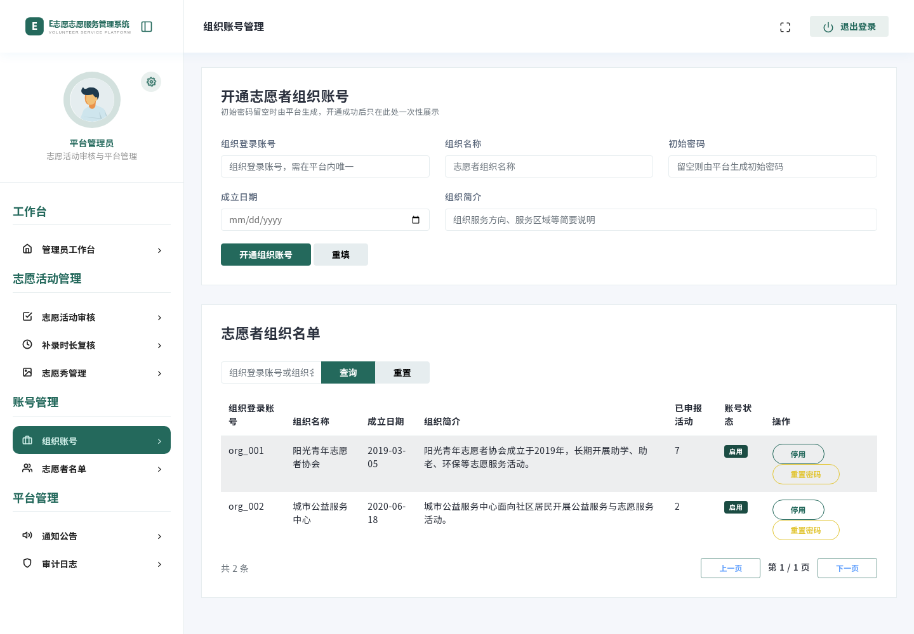

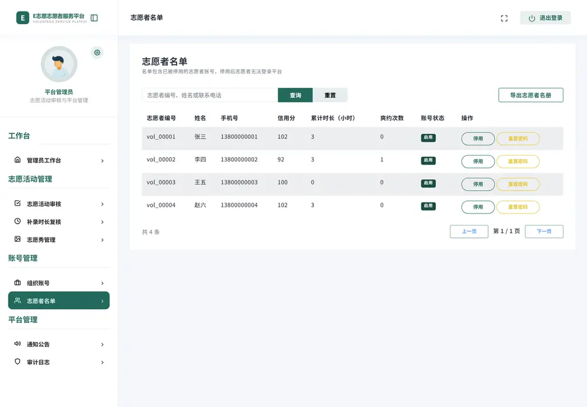

### 4.30 通知公告与附件

平台管理员在「通知公告」页可以发布、修改与删除通知公告，并为每条公告上传附件
（支持 jpg、png、gif、pdf、doc、docx、xls、xlsx、txt、zip，单个文件不超过 10MB）、
查看附件列表与删除附件。公告与附件在公众门户同步展示，附件可直接下载。

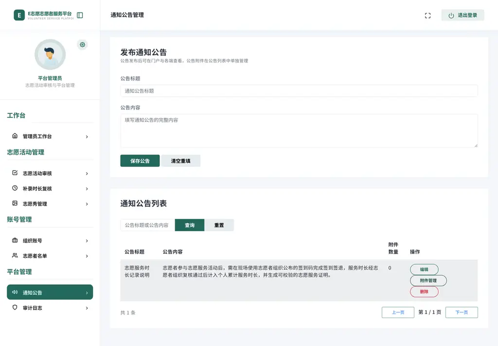

### 4.31 审计日志

平台管理员在「审计日志」页按操作类型与操作账号查询关键操作记录：活动审核与流转、活动重新申报、
报名审核与移除、服务时长复核与补录复核、活动结算、账号开通与启停、密码重置与修改、
公告发布与删除、志愿秀删除等操作均记录操作账号、角色、操作对象、详情、来源 IP 与操作时间。

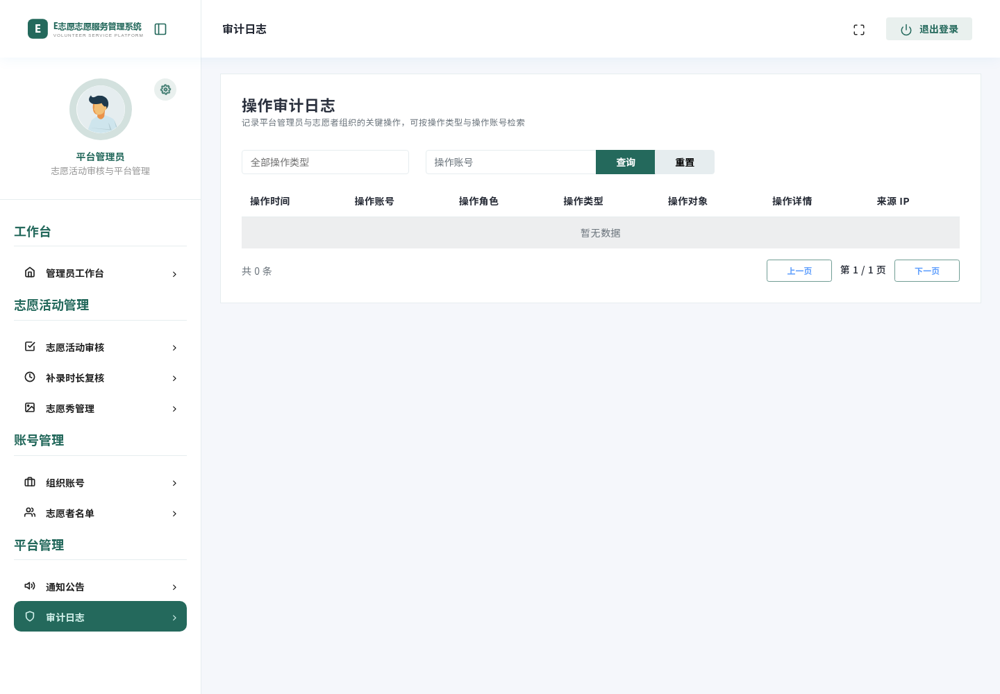

### 4.32 服务对象确认

服务对象（受助人或带队人）无需注册登录，打开门户「服务确认」页即可核对本次服务：

1. 志愿者组织在「签到与时长复核」页为某条服务记录生成服务确认单，将确认码交付给服务对象；
2. 服务对象在「服务确认」页填写确认码与本人手机号（需与组织预留号码一致），选择「确认服务」或「否认服务」，
   可填写意见后提交；
3. **确认**表示本次服务获得责任方复核与对象确认双方验证，记录标记为「服务对象已确认」；
4. **否认**时若该时长已计入累计服务时长，平台立即冲销（扣回累计时长与信用分）并通知志愿者组织核实，
   该记录不能被志愿者组织再次确认。

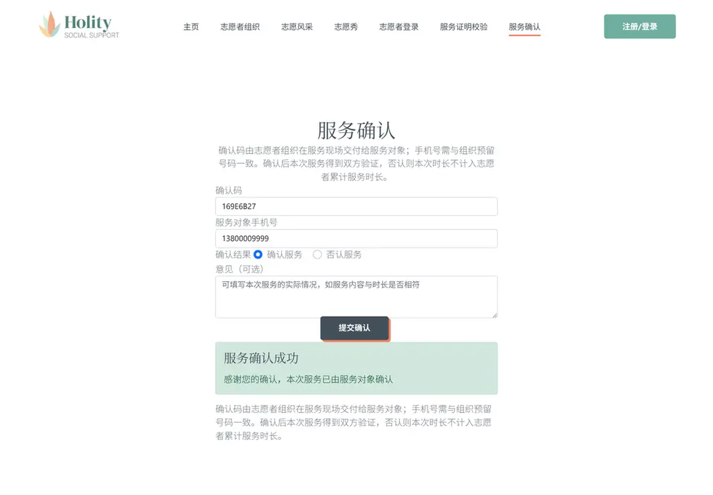

### 4.33 异常时长裁定

平台在服务时长复核与补录时按「时长异常规则」逐条检测，命中规则的记录不计入志愿者累计服务时长，
转入平台管理员的「异常时长待裁定」列表。规则保存在异常规则表中，可配置阈值与启停，当前内置：

| 规则 | 阈值 | 说明 |
| --- | --- | --- |
| 单日累计服务时长上限 | 12 小时 | 同一志愿者同一自然日已计入时长叠加本次后超过上限 |
| 单条服务时长上限 | 12 小时 | 单条服务记录时长超过上限 |
| 夜间服务 | 0 时至 5 时 | 服务开始时间落在夜间时段 |
| 同一报名补录条数上限 | 3 条 | 同一志愿者在同一活动的补录记录达到上限 |

平台管理员在「补录时长复核」页的「异常时长待裁定」区块按关键字查询待裁定记录，查看命中的规则名称后选择
「维持计入」或「冲销」并填写裁定意见；此外定时巡检会把事后出现的单日超限记录标记出来并通知平台管理员，
同样在该区块裁定。


## 5 权限与安全说明

1. **访问控制**：公众门户、志愿者注册界面、志愿服务证明校验页、门户公开数据接口与附件下载无需登录；
   志愿者页面与签到签退接口仅 `ROLE_VOLUNTEER` 角色可访问；志愿者组织的报名审核、签到码、服务时长复核、
   时长补录、活动公告与培训管理、活动状态流转与结算、导出接口仅 `ROLE_ORGANIZATION` 角色可访问；
   平台管理员页面与接口（含账号管理、补录复核、通知公告、审计日志、志愿秀管理）仅 `ROLE_ADMIN` 角色可访问；
   志愿活动接口由志愿者组织与平台管理员共同使用。
2. **未登录访问**：未登录访问受保护的页面或接口时，系统自动跳转到登录页面。
3. **越权访问**：登录角色与其访问的页面、接口不匹配时，系统返回 403 拒绝访问。
4. **账号状态**：平台管理员可停用组织账号与志愿者账号，停用后该账号无法登录平台（登录信息中的启用标记为停用）。
5. **密码存储**：登录密码以 PBKDF2WithHmacSHA256 加盐摘要方式保存（120000 次迭代、16 字节随机盐），
   同一密码两次加密的结果不同；历史版本使用 MD5 摘要保存的账号在登录校验通过后由平台自动改写为加盐密文，
   无需人工重置密码。系统中不保存密码明文，日志中也不记录密码等敏感信息；平台管理员重置密码时生成一次性随机密码。
6. **证明防伪**：志愿服务证明的校验码由平台密钥对志愿者累计服务数据计算 HMAC-SHA256 摘要得到，
   密钥通过 `EVOLUNTEER_CERT_SECRET` 环境变量配置，数据变动或密钥不同都无法生成一致的校验码。
7. **文件上传**：公告附件与志愿秀图片限制为 jpg、png、gif、pdf、doc、docx、xls、xlsx、txt、zip 类型，
   单个文件不超过 10MB，服务端以随机存储名保存，下载时校验存储名，避免目录穿越。
8. **操作审计**：活动审核与流转、报名审核与移除、服务时长复核与补录复核、活动结算、账号开通与启停、
   密码重置与修改、公告发布与删除、志愿秀删除等关键操作写入操作审计表，可按操作类型与操作账号查询。
9. **注销**：注销会清除服务端登录会话与浏览器会话 Cookie，会话失效后必须重新登录。

## 6 业务状态说明

志愿活动状态由 `activity` 表的 `activity_state` 字段表示：

| 状态值 | 状态名称 | 说明 |
| --- | --- | --- |
| 0 | 审核中 | 志愿者组织已申报，等待平台管理员审核 |
| 1 | 未开始 | 平台管理员审核通过，尚未到活动开始时间；也可由志愿者组织人工置为进行中 |
| 2 | 进行中 | 活动正在开展；到达活动开始时间后由定时任务自动置为进行中 |
| 3 | 已结束 | 活动已完成；超过活动结束时间后由定时任务自动置为已结束，也可由志愿者组织人工提前结束 |
| 4 | 审核未通过 | 平台管理员审核未通过，志愿者组织可查看原因、修改后重新申报或删除 |

活动报名状态由 `participate` 表的 `participate_applystate` 字段表示：

| 状态值 | 状态名称 | 说明 |
| --- | --- | --- |
| 0 | 待审核 | 志愿者已提交报名申请，等待志愿者组织审核 |
| 1 | 已通过 | 志愿者组织通过报名申请 |
| 2 | 未通过 | 志愿者组织驳回报名申请 |
| 3 | 候补 | 活动名额已满，报名自动进入候补队列，释放名额后自动递补 |

服务时长复核状态由 `checkin` 表的 `checkin_timecheck` 字段表示：

| 状态值 | 状态名称 | 说明 |
| --- | --- | --- |
| 空 | 待复核 | 已签退并核算出服务时长，等待志愿者组织复核 |
| 1 | 已确认 | 记录来源为平台签到时由志愿者组织确认，来源为组织补录时由平台管理员确认；确认后计入累计服务时长 |
| 2 | 已驳回 | 复核方驳回该时长，本次时长不计入累计服务时长 |
| 3 | 已冲销 | 已计入后因服务对象否认或平台管理员裁定而被冲销，累计时长与信用分同步扣回 |

签到轨迹标记由 `checkin` 表的 `checkin_flag` 字段表示：`1` 表示签到位置在活动围栏内且时长正常，
`2` 表示超出地理围栏、缺少定位或服务时长异常，需要志愿者组织重点复核。
志愿者志愿服务信用分初始为 100 分，服务时长复核通过加 2 分（上限 120 分），活动结算时爽约扣 10 分，
低于 60 分时暂停报名新的志愿活动。

报名参加确认状态由 `participate` 表的 `participate_confirmstate` 字段表示：空表示待确认，
`1` 表示志愿者已确认参加，`2` 表示志愿者已放弃参加（该报名会被移除并释放名额）。
活动开始前 24 小时仍未确认、且报名已满 12 小时的报名，由定时任务自动释放名额并递补候补志愿者。
服务记录来源由 `checkin` 表的 `checkin_source` 字段表示：`1` 为志愿者现场平台签到，`2` 为志愿者组织补录。
服务对象确认状态由 `checkin` 表的 `checkin_objectconfirm` 字段表示：空表示待确认，`1` 表示服务对象已确认，
`2` 表示服务对象已否认（若该时长已计入则同时被冲销）。
时长异常规则编码由 `checkin` 表的 `checkin_anomaly` 字段表示，裁定意见写入 `checkin_anomalyremark`，
写入裁定意见即表示该异常已处理。

## 7 常见问题

**问题 1：启动时提示无法连接数据库。**
请确认 MySQL 服务已启动、`e_volunteer_platform` 数据库已通过数据库脚本创建，并检查 `application.properties`
中的数据库地址、账号与密码是否正确。

**问题 2：中文数据显示为乱码。**
数据库创建脚本已指定 `utf8mb4` 字符集，如出现乱码，请确认数据库与数据表字符集为
`utf8mb4`（推荐 `utf8mb4_general_ci` 排序规则），并确认连接串中包含 `characterEncoding=utf-8`。

**问题 3：登录后提示账号不存在或无权限。**
请使用初始化数据中的账号登录（平台管理员 `admin_001`，志愿者组织 `org_001`、`org_002`，志愿者 `vol_00001`～`vol_00004`），
初始密码为 `123456`；志愿者也可使用注册成功后返回的志愿者编号与注册时设置的密码登录。
账号与角色保存在 `e_user` 表中，可自行扩展。

**问题 4：活动审核后活动未出现在列表中。**
活动审核通过后状态由「审核中」变为「未开始」，请在志愿者组织端「未开始的活动」菜单中查看。

**问题 5：页面时间显示与数据库记录相差数小时。**
请确认数据库连接串中的 `serverTimezone` 与数据库服务器时区一致
（推荐与平台保持一致，使用 `serverTimezone=Asia/Shanghai`）。

**问题 6：志愿者签到时提示签到码不正确。**
签到码由志愿者组织在活动现场公布，可在志愿者组织端「签到与时长复核」页查看或重新生成；
签到码仅在活动开始前 60 分钟至活动结束期间有效，且需要浏览器授权获取当前位置。

**问题 7：服务时长已经签退，为什么累计服务时长没有变化。**
签退后服务时长处于「待复核」状态，需要志愿者组织在「签到与时长复核」页确认后才会计入累计服务时长；
若签到位置超出活动围栏或时长异常，记录会被标记为异常，请与志愿者组织确认。

**问题 8：志愿服务证明校验失败。**
校验码由志愿者当前的累计服务数据计算得出，若累计服务时长或服务记录发生变化，旧校验码将失效，
请在志愿者端「志愿服务证明」页重新查看最新校验码后再校验。

**问题 9：活动状态不是我设置的，却变成了「进行中」或「已结束」。**
平台定时任务会按活动时间自动流转状态：到达活动开始时间后自动置为进行中，超过活动结束时间后自动置为已结束。
志愿者组织也可以在「未开始的活动」「进行中的活动」页人工提前把活动置为进行中或已结束。

**问题 10：志愿者组织补录的服务时长为什么没有计入累计服务时长。**
补录记录需要由平台管理员在「补录时长复核」页确认后才计入累计服务时长；
若补录时段与已有服务记录重叠、服务时间晚于当前时间或单条超过 24 小时，补录会被直接拒绝。

**问题 11：报名已通过，为什么名额又被释放了。**
报名通过后志愿者需要在「我的报名」中确认参加；活动开始前 24 小时仍未确认（且报名已通过满 12 小时）的报名，
平台会自动释放名额并递补候补志愿者。志愿者也可以主动选择「放弃参加」。

**问题 12：签到码为什么用不了。**
签到码每 120 秒自动轮换，屏幕上的旧签到码会被判为过期，请以志愿者组织当前展示的签到码为准；
若组织点击过「更换密钥并重新生成」，此前公布的签到码也会立即失效。

**问题 13：服务对象怎么确认服务。**
志愿者组织在「签到与时长复核」页生成服务确认单后，把确认码交给服务对象；服务对象打开门户「服务确认」页，
填写确认码与本人手机号即可确认或否认。否认且该时长已计入时，平台会冲销该时长并通知志愿者组织核实。

**问题 14：为什么我的服务时长没有计入累计时长。**
服务时长需要责任方复核（平台签到由志愿者组织复核、组织补录由平台管理员复核）；
若记录命中时长异常规则（如单日累计超过 12 小时、单条超过 12 小时、夜间服务、补录条数过多），
会转入平台管理员裁定，裁定计入后才会计入累计时长。

**问题 15：忘记登录密码怎么办。**
已登录的用户可在「我的档案」页自助修改密码；忘记密码的用户请联系平台管理员，
由管理员在「组织账号」或「志愿者名单」页重置密码，重置后会生成一次性新密码，请及时修改。
